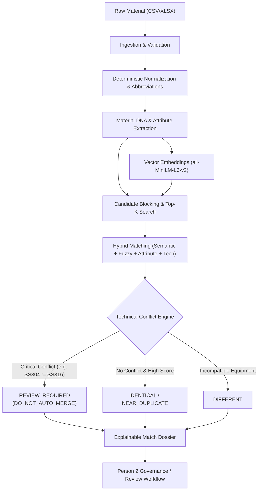

# National Material Master & Intelligence Platform for CPSEs
## Person 1 — Core AI Material Intelligence Engine (SIH 2026)

An industrial-grade, AI-driven material intelligence and harmonization engine engineered to unify disparate material master records across Central Public Sector Enterprises (CPSEs) including **IOCL**, **NTPC**, **BHEL**, and **GAIL**.

---

## 1. System Overview & Core Philosophy

CPSEs frequently catalog identical or functionally equivalent engineering components using divergent descriptions, units, naming conventions, and abbreviations:
- **IOCL**: `IOCL-101` — `"CS PIPE 10 INCH SCH40"`
- **NTPC**: `NTPC-P-782` — `"CARBON STEEL PIPE 10 IN SCHEDULE 40"`
- **BHEL**: `BHEL-PIPE-55` — `"CS SEAMLESS PIPE 10 IN SCH 40"`

### The Core Principle: Technical Meaning Over String Similarity
Traditional text similarity algorithms (`Levenshtein -> percentage -> merge`) catastrophically fail in industrial operations. Consider:
- **Input A**: `"SS304 VALVE 4 INCH 150#"`
- **Input B**: `"SS316 VALVE 4 INCH 150#"`

Textually and semantically, these descriptions are over 95% similar. However, **SS304** (18% Cr, 8% Ni) and **SS316** (contains 2-3% Molybdenum) have completely different corrosion and chemical capabilities. Auto-merging them in a refinery or power plant leads to catastrophic failure.

Therefore, this engine enforces:
$$\textbf{CRITICAL CONFLICT} > \textbf{SIMILARITY SCORE}$$
If any critical technical conflict exists, the match is classified as `REVIEW_REQUIRED`, recommended as `DO_NOT_AUTO_MERGE`, and auto-merging is strictly prohibited.

---

## 2. Material AI Architecture & Pipeline



---

## 3. Engineering Modules

### 3.1 Normalization Engine
- **Whitespace & Separator Harmonization**: Standardizes `M16*50`, `M16 × 50`, `M16x50` into uniform `M16 X 50`.
- **Centralized CPSE Domain Abbreviation Dictionary** (`app/utils/text.py`):
  - `SS` $\to$ `STAINLESS STEEL`
  - `CS` $\to$ `CARBON STEEL`
  - `MS` $\to$ `MILD STEEL`
  - `GI` $\to$ `GALVANIZED IRON`
  - `CI` $\to$ `CAST IRON`
  - `DI` $\to$ `DUCTILE IRON`
  - `NB` $\to$ `NOMINAL BORE`
  - `OD` $\to$ `OUTSIDE DIAMETER`
  - `ID` $\to$ `INSIDE DIAMETER`
  - `SCH` $\to$ `SCHEDULE`
  - `THK` $\to$ `THICKNESS`
  - `SMLS` $\to$ `SEAMLESS`
  - `HEX` $\to$ `HEXAGONAL`
  - `FLG` $\to$ `FLANGE`
  - `VLV` $\to$ `VALVE`
  - `BLT` $\to$ `BOLT`

### 3.2 Unit Normalization Engine (`app/utils/units.py`)
- **Deterministic linear conversion to standard SI units**:
  - `inch`, `in`, `"` $\to$ `mm` ($1\text{ in} = 25.4\text{ mm}$)
  - `ft`, `feet`, `'` $\to$ `mm` ($1\text{ ft} = 304.8\text{ mm}$)
  - `m`, `meter` $\to$ `mm` ($1\text{ m} = 1000\text{ mm}$)
  - `psi` $\to$ `bar` ($1\text{ psi} = 0.0689476\text{ bar}$)
- Ambiguous units are flagged for review (`FLAG_FOR_REVIEW`).

### 3.3 Material DNA Extraction (`app/ai/attribute_extraction.py`)
Extracts structured engineering properties and produces confidence scores:
- `material_type`: Pipe, Valve, Bolt, Flange, Gasket, Fitting, Plate, Cable, etc.
- `material`: Carbon Steel, Stainless Steel, Mild Steel, Copper, Brass, etc.
- `grade`: SS304, SS316, A106, A53, A193 B7, IS 2062, etc.
- `diameter`, `length`, `width`, `height`, `thickness` (all normalized to mm).
- `pressure`: 150#, 300#, 600#, PN16, 10 BAR, etc.
- `schedule`: 40, 80, 160, STD, XS, XXS.
- `form`: Seamless, Welded, Forged, Cast, Hexagonal.
- `standard`: ASTM A106, ASME B16.5, DIN 933, IS 1239, API 5L.
- `fingerprint_hash`: Deterministic SHA-256 hash of canonical attributes.

### 3.4 Hybrid Matching Formula
$$\text{Final Score} = 0.30 \times \text{Semantic} + 0.20 \times \text{Fuzzy} + 0.30 \times \text{Attribute} + 0.20 \times \text{Technical}$$
- **Semantic**: Cosine similarity via Sentence Transformers (`all-MiniLM-L6-v2`).
- **Fuzzy**: Multi-metric RapidFuzz composite (`0.40 * token_set + 0.30 * token_sort + 0.30 * wratio`).
- **Attribute**: Ratio of agreeing technical attributes over evaluated attributes.
- **Technical**: Technical rule compliance score computed by the conflict engine.

### 3.5 Conflict Severity Matrix
- `MATCH`: Exact equivalence within industrial tolerance.
- `MINOR_DIFFERENCE`: Cosmetic or non-critical variation.
- `MAJOR_DIFFERENCE`: Standard revision or alternative compatible schedule.
- `CRITICAL_CONFLICT`: Incompatible metallurgy (`SS304` vs `SS316`), pressure class (`150#` vs `300#`), or size difference $> 10\%$.

### 3.6 Common National Material Code (CNMC) Engine
- Stable, collision-safe, deterministic national identifier: `CNMC-000001`.
- Mappings in `cpse_material_mapping` link individual enterprise codes without mutating original descriptions.
- Canonical Description Picker evaluates attribute completeness, standards, and specificity to recommend the primary national description.

---

## 4. Database Schema

The database design cleanly enforces Person 1 ownership and provides foundation tables for Person 2:

1. **`cpse`**: Master catalog of CPSEs (IOCL, NTPC, BHEL, GAIL).
2. **`materials`**: Material master records. `original_description` is strictly immutable.
3. **`material_attributes`**: Material DNA structured parameters and normalized dimensions.
4. **`material_embeddings`**: Dense vector representation (384 dimensions).
5. **`material_matches`**: Pairwise match records with hybrid scores, classification, and explanation.
6. **`material_conflicts`**: Discrepancies with severity (`INFO`, `MINOR`, `MAJOR`, `CRITICAL`).
7. **`national_materials`**: Canonical CNMC records with SHA-256 identity hash.
8. **`cpse_material_mapping`**: Foundation mapping table for CPSE item linkage.
9. **`ingestion_jobs`**: Asynchronous upload tracking with detailed row validation errors.

---

## 5. API Reference

All routes are documented in the interactive OpenAPI Swagger UI at `/docs`.

| Method | Endpoint | Description |
|---|---|---|
| `POST` | `/api/ingestion/upload` | Ingest CSV or XLSX material master file |
| `GET` | `/api/ingestion/jobs/{id}` | Query ingestion job status and error logs |
| `GET` | `/api/materials` | Search and filter materials by CPSE, category, status |
| `GET` | `/api/materials/{id}` | Retrieve single material details with Material DNA |
| `GET` | `/api/materials/{id}/dna` | Get Material DNA breakdown and fingerprint hash |
| `GET` | `/api/materials/{id}/matches` | List all matches involving this material |
| `GET` | `/api/materials/{id}/conflicts` | List technical conflicts for this material |
| `POST` | `/api/normalization/normalize` | Interactive preview of normalization and units |
| `GET` | `/api/normalization/abbreviations` | Centralized domain abbreviation dictionary |
| `POST` | `/api/dna/extract` | On-the-fly Material DNA extraction |
| `POST` | `/api/matching/run` | Execute batch candidate blocking and hybrid matching |
| `POST` | `/api/matching/compare` | Interactive pairwise comparison with explainability |
| `GET` | `/api/matches` | Filter matches by CPSE, classification, review_required |
| `GET` | `/api/matches/{id}` | Get full explainable match dossier |
| `GET` | `/api/conflicts` | List technical conflicts by severity and attribute |
| `GET` | `/api/conflicts/{id}` | Get conflict details |
| `GET` | `/api/classification/rules` | Inspect active hybrid weights and thresholds |
| `POST` | `/api/cnmc` | Generate or assign stable CNMC code |
| `GET` | `/api/cnmc` | List national material master catalog |
| `GET` | `/api/cnmc/{id}` | Get CNMC details and linked CPSE mappings |
| `GET` | `/api/cnmc/{id}/mappings` | Get CPSE mappings for a specific CNMC |

---

## 6. Example API Requests and Responses

### Example 1: Critical Near-Miss Comparison (`POST /api/matching/compare`)

#### Request:
```json
{
  "source_description": "SS304 VALVE 4 INCH 150#",
  "target_description": "SS316 VALVE 4 INCH 150#"
}
```

#### Response:
```json
{
  "source_description": "SS304 VALVE 4 INCH 150#",
  "target_description": "SS316 VALVE 4 INCH 150#",
  "scores": {
    "semantic": 0.8842,
    "fuzzy": 0.9025,
    "attribute": 0.7500,
    "technical": 0.7000,
    "final": 0.8108
  },
  "classification": "REVIEW_REQUIRED",
  "review_required": true,
  "recommendation": "DO_NOT_AUTO_MERGE",
  "confidence": 0.811,
  "technical_conflicts": [
    {
      "id": null,
      "attribute": "grade",
      "source_value": "SS304",
      "target_value": "SS316",
      "severity": "CRITICAL",
      "reason": "Critical metallurgy conflict: SS304 vs SS316 have fundamentally different corrosion resistance (Molybdenum content). NEVER auto-merge.",
      "created_at": null
    }
  ],
  "explanation": {
    "why_matched": [
      "Identical material type (Valve)",
      "Identical diameter (101.6)",
      "Identical pressure (150#)",
      "High semantic vector similarity (0.88)",
      "High lexical token match (0.90)"
    ],
    "what_matched": [
      "Material Type: Valve",
      "Diameter: 101.6",
      "Pressure: 150#"
    ],
    "what_differed": [
      "Grade: SS304 vs SS316"
    ],
    "recommendation": "DO_NOT_AUTO_MERGE",
    "review_required": true,
    "confidence": 0.811,
    "technical_conflicts": [ ... ]
  }
}
```

---

## 7. Setup & Execution Guide

### Local Development Setup
```bash
# 1. Create and activate virtual environment
python3 -m venv venv
source venv/bin/activate

# 2. Install dependencies
pip install -r requirements.txt

# 3. Initialize database and seed CPSEs
python -m app.db.seed

# 4. Ingest 120+ synthetic material dataset
python -m data.seed_data

# 5. Run FastAPI development server
uvicorn app.main:app --host 0.0.0.0 --port 8000 --reload
```

### Running Tests
All 6 mandatory acceptance tests and comprehensive test suites run via pytest:
```bash
pytest -v
```

### Docker Deployment
```bash
docker-compose up --build
```
Access the application at `http://localhost:8000/docs`.
